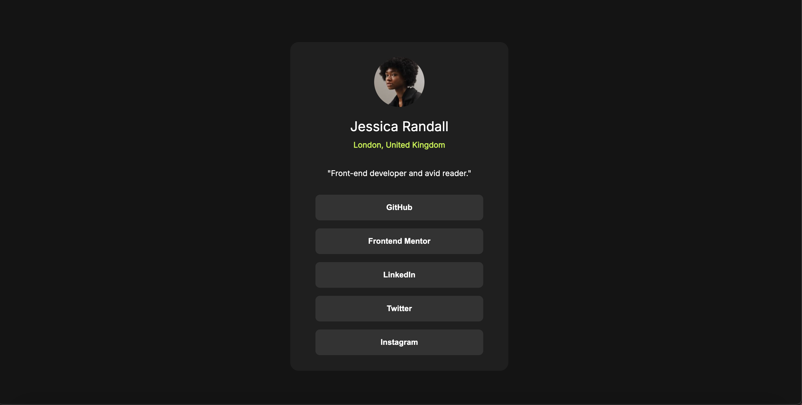
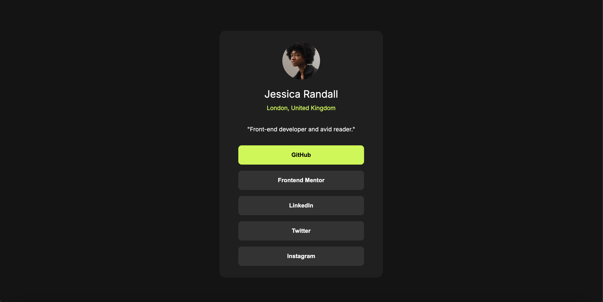

# Frontend Mentor - Social links profile solution

This is a solution to the [Social links profile challenge on Frontend Mentor](https://www.frontendmentor.io/challenges/social-links-profile-UG32l9m6dQ). Frontend Mentor challenges help you improve your coding skills by building realistic projects. 

## Table of contents

- [Overview](#overview)
  - [The challenge](#the-challenge)
  - [Screenshot](#screenshot)
  - [Links](#links)
- [My process](#my-process)
  - [Built with](#built-with)
  - [What I learned](#what-i-learned)
  - [Continued development](#continued-development)
  - [Useful resources](#useful-resources)
- [Author](#author)

## Overview
This goal is to make a social links profile that looks as similar as possible to the given image:

### The challenge

Users should be able to:

- See hover and focus states for all interactive elements on the page

### Screenshots

### Links

- Solution URL: [Solution URL here](https://www.frontendmentor.io/solutions/social-links-profile-with-just-flex-boxes-y2BDEDrJND)
- Live Site URL: [Live site URL here](https://ramagall.github.io/social-links-profile-main/)

## My process
I started out with the HTML which is pretty basic considering there are very little pieces to this challenge. Then I spent most of the time messing with css to find the right values that looked like that version I was attempting to mimic.
### Built with

- Semantic HTML5 markup
- CSS custom properties
- Flexbox

**Note: These are just examples. Delete this note and replace the list above with your own choices**

### What I learned

This project got me more comfortable with using flexboxes to control the layout of my webpage. I also learned about some weird quirks with ios that would make images appear differently if there aren't set heights and widths. 

### Continued development

In the future I want to better understand how to make responsive apps that look good on both mobile and desktop.

## Author

- GitHub - [Rodolfo Antonio Magallanes Barreras](https://github.com/ramagall)
- Frontend Mentor - [@ramagall](https://www.frontendmentor.io/profile/ramagall)

